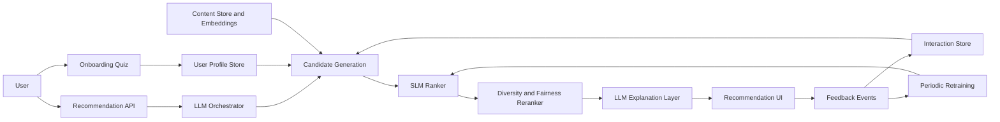

# Cross-Domain Recommendation MVP Plan

## Overview

Build an MVP of the cross-domain intelligent recommendation system from the architecture diagram, with the ML training handled by reusable code for the selected Kaggle movie, music, and books datasets.

## Implementation Checklist

- Create the greenfield monorepo structure with Next.js frontend, FastAPI backend, ML workspace, and local infra.
- Define PostgreSQL schema for users, profiles, content, interactions, embeddings, recommendations, and model versions.
- Build dataset ingestion scripts for The Movies Dataset, the Spotify music dataset, and the Books Dataset.
- Implement onboarding quiz, profile normalization, and LLM-assisted profile enrichment.
- Implement hybrid candidate generation from content similarity, similar users, metadata filters, and cross-domain expansion.
- Write the full ML training pipeline: normalize datasets, synthesize cross-domain training pairs, build features, train LightGBM, evaluate, and export artifacts.
- Expose the recommendation API with ranker inference, diversity/fairness reranking, and explanation generation.
- Build the recommendation UI and store feedback events for the improvement loop.
- Add periodic retraining/evaluation scripts and model version tracking.

## Recommended MVP Stack

Use a Python-first backend because the project has local datasets and needs model-training code:

- Frontend: Next.js + React + TypeScript for onboarding, recommendation cards, explanations, and feedback actions.
- Backend API: FastAPI for user/profile APIs, recommendation endpoints, tool orchestration, and feedback ingestion.
- Database: PostgreSQL with `pgvector` for user/content embeddings, plus normal relational tables for users, content, interactions, ratings, and feedback.
- Cache/jobs: Redis for hot recommendation caches and lightweight background queues.
- ML/ranking: LightGBM first for the SLM ranker because it works well with tabular recommendation features, is explainable, and is fast to iterate. Add a neural reranker later if needed.
- LLM layer: OpenAI/Claude/Gemini-compatible abstraction for onboarding understanding, query expansion, cross-domain explanation, and natural-language recommendation reasons.
- Training: Python scripts using the Kaggle datasets to clean data, create a unified catalog, generate training pairs, build features, train the ranker, evaluate quality, and export model artifacts. You should not need to hand-write model-training logic.

## Datasets To Support

The training code should target these sources:

- Movies: Kaggle `rounakbanik/the-movies-dataset`.
  - Local files found: `movie_dataset/movies_metadata.csv`, `movie_dataset/keywords.csv`, `movie_dataset/links.csv`, `movie_dataset/ratings.csv`.
  - `ratings.csv` has the standard `userId,movieId,rating,timestamp` schema, so it can drive the first supervised ranker.
  - Not currently found: `credits.csv`, `links_small.csv`.
  - Useful fields: movie title, overview, genres, popularity, vote average/count, release date, keywords, cast/crew, and explicit user ratings.
- Music: Kaggle Spotify dataset used by `vatsalmavani/music-recommendation-system-using-spotify-dataset`.
  - Local files found: `music_dataset/data_music.csv`, `music_dataset/data_by_artist.csv`, `music_dataset/data_by_genres.csv`, `music_dataset/data_by_year.csv`.
  - Not currently found: `data_w_genres.csv`.
  - Useful fields: track/artist names, genres, popularity, release year, and Spotify audio features such as danceability, energy, acousticness, loudness, speechiness, instrumentalness, liveness, valence, and tempo.
- Books: Kaggle `abdallahwagih/books-dataset`.
  - Local files found: `book_dataset/book_data.csv`.
  - Not currently found: `intents.json`.
  - Useful fields: ISBN, title, subtitle, authors, categories, thumbnail, description, published year, and average rating.

Because the movie dataset now includes real user ratings while books and music are still item-only, the MVP training code should support two training modes:

- Supervised movie ranking from `ratings.csv`, joined through `links.csv` to `movies_metadata.csv` and `keywords.csv`.
- Cross-domain bootstrap ranking for books and music using content similarity, popularity, category matches, synthetic weak labels, and later real app feedback.

## Target MVP Flow



## Repo Structure To Create

Start with a small monorepo:

- `apps/web`: Next.js frontend.
- `apps/api`: FastAPI backend and recommendation service.
- `packages/shared`: shared API types/schemas if useful.
- `ml`: dataset preparation, feature generation, model training, evaluation, and exported artifacts.
- `infra`: Docker Compose, database init, migrations, and deployment notes.
- `docs`: architecture notes, ranking metrics, data contracts, and feedback loop design.

## Phase 1: Foundations

Create the monorepo, local development setup, and database schema. Model the core entities first:

- Users and auth identities.
- User profiles: onboarding answers, preferences, avoided items, exploration level, derived embedding.
- Content items: domain type such as movie/book/music, metadata, genres/tags, popularity, embeddings.
- Interactions: views, clicks, likes, dislikes, skips, watch/read/listen events, ratings, timestamps.
- Recommendation requests/results: stored for debugging and later training labels.

For the MVP, use seed/import scripts to load the Kaggle datasets into PostgreSQL and generate embeddings for normalized item text. The import code should output one unified item table with `domain`, `source_id`, `title`, `description`, `creators`, `genres`, `tags`, `year`, `popularity`, `rating`, and domain-specific metadata.

## Phase 2: Onboarding and Profile Creation

Build the user entry path shown in the diagram:

- Login/sign-up placeholder or real auth depending on deployment target.
- Onboarding quiz with genres, top picks, mood/tone, exploration level, and avoid list.
- Backend endpoint to normalize quiz answers into a structured profile.
- LLM-assisted profile enrichment: infer taste descriptors, cross-domain affinities, and initial query terms.
- Store profile features and an embedding for retrieval.

## Phase 3: Candidate Generation

Implement hybrid candidate retrieval before ranking:

- Content retrieval: retrieve items by metadata filters, tags/genres, popularity, and embedding similarity.
- Cross-user retrieval: find similar users from profile or interaction embeddings, then fetch items liked by similar users.
- Cross-domain expansion: map user taste from one domain to another, such as movies to books or music.
- Deduplicate, filter avoid-list items, and exclude items the user already consumed.

Expose this behind an internal backend module like `candidate_generation`, not directly to the UI.

## Phase 4: Training Code To Write

Write the model-training code as a reproducible Python pipeline under `ml` so the training can be run with commands instead of manual ML work:

- `ml/config.yaml`: dataset paths, feature settings, train/test split, model parameters, and artifact paths.
- `ml/src/recros_ml/ingest`: loaders for movies, music, and books.
- `ml/src/recros_ml/normalize`: converts every dataset into common `items`, `users`, and `interactions` tables.
- `ml/src/recros_ml/features`: builds user-item features such as text similarity, genre/category overlap, popularity-adjusted score, recency, domain match, creator match, and audio-feature similarity for music.
- `ml/src/recros_ml/train.py`: trains the first LightGBM ranking model.
- `ml/src/recros_ml/evaluate.py`: reports NDCG@K, Recall@K, MAP@K, coverage, novelty, and cross-domain diversity.
- `ml/src/recros_ml/export.py`: exports the model, encoders, feature schema, metrics, and version metadata.
- `ml/src/recros_ml/inference.py`: provides a simple function the FastAPI backend can call to score candidate items.

The first training implementation should use LightGBM because it is beginner-friendly, fast, strong on tabular ranking features, and easier to inspect than a neural model.

Recommended commands:

```bash
python -m recros_ml.ingest --config ml/config.yaml
python -m recros_ml.build_features --config ml/config.yaml
python -m recros_ml.train --config ml/config.yaml
python -m recros_ml.evaluate --config ml/config.yaml
python -m recros_ml.export --config ml/config.yaml
```

Training strategy:

- Use `movie_dataset/ratings.csv` as the strongest initial supervised signal.
- Join `ratings.csv.movieId` to `links.csv.movieId`, then map `links.csv.tmdbId` to `movies_metadata.csv.id` and `keywords.csv.id`.
- Convert high ratings to positive examples and low ratings to negative examples.
- Generate candidate negatives from unseen movies and sampled cross-domain books/music.
- Treat books and music as bootstrap domains using normalized book `average_rating` plus `ratings_count`, music `popularity`, metadata similarity, and pseudo-user clusters.
- Use item metadata and embeddings to transfer movie-user preferences into book/music features.
- When real app feedback exists, replace synthetic book/music labels with actual likes, skips, saves, ratings, and completions.

Keep the model interface simple: input candidate feature rows, output relevance scores.

## Phase 5: Diversity, Fairness, and Debiasing

Add a post-rank reranker that turns raw relevance scores into better recommendation lists:

- Enforce domain and genre diversity so the feed does not collapse into one cluster.
- Penalize overexposed popular items to reduce popularity bias.
- Preserve strong relevance while injecting controlled exploration.
- Track basic metrics: catalog coverage, average popularity, repeated-genre rate, and cross-domain ratio.

This should be deterministic/configurable for the MVP so behavior is easy to debug.

## Phase 6: Explanations and Output UI

Build the recommendation output experience:

- Recommendation API returns item cards, relevance/debug metadata, and explanation inputs.
- LLM explanation layer generates short reasons based on user preferences, item metadata, and ranker/reranker features.
- UI shows top recommendations, cross-domain suggestions, and explanation text.
- Include feedback buttons: like, dislike, skip, save, consumed/rated.

For the MVP, explanations can be generated on demand and cached per recommendation result.

## Phase 7: Feedback Loop

Close the loop with event capture and periodic improvement:

- Store all recommendation impressions and user actions.
- Update interaction embeddings or aggregate counters after feedback.
- Add a scheduled retraining script that rebuilds features from the latest interactions using the same `ml` pipeline.
- Compare new model metrics against the previous model before promotion.
- Keep model versions so recommendation results can be traced back to the model that produced them.

## Phase 8: MVP Validation

Before expanding the system, validate it with a small test group or offline replay:

- Check that cold-start users receive sensible cross-domain results.
- Confirm feedback changes future recommendations.
- Compare ranked results against baseline popularity and embedding-only retrieval.
- Review explanations for accuracy and hallucination risk.
- Inspect diversity/fairness metrics for over-concentration.

## Key MVP Deliverables

- Working onboarding flow.
- Imported dataset-backed content catalog.
- Persistent profile, content, interaction, and recommendation stores.
- Hybrid candidate generator.
- Complete beginner-friendly training code for movies, music, and books.
- Trainable LightGBM ranker with exported artifacts and inference helper.
- Diversity/fairness reranking module.
- LLM-generated explanations.
- Recommendation UI with feedback capture.
- Retraining/evaluation script for model iteration.

## Deliberately Deferred

- Real-time streaming personalization.
- Complex multi-armed bandits.
- Large-scale distributed feature store.
- Full production observability and autoscaling.
- Deep neural recommender unless LightGBM plateaus.
- Mobile apps or browser extensions.
